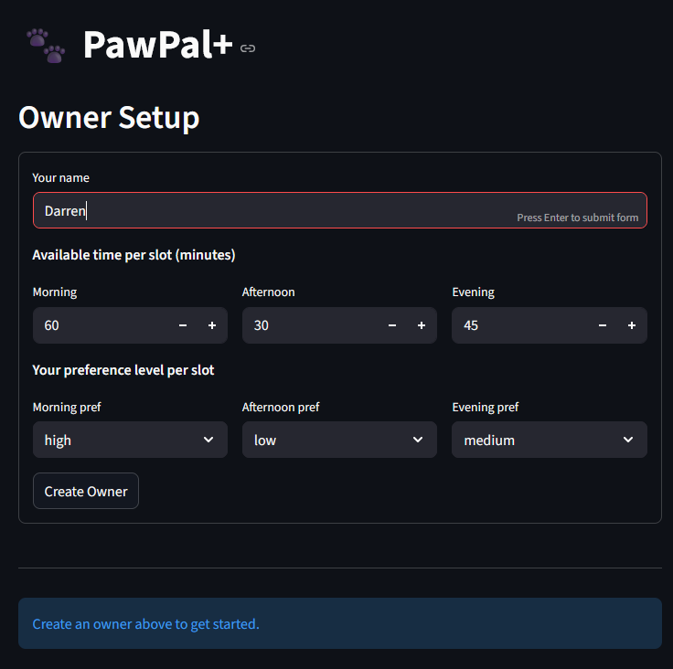
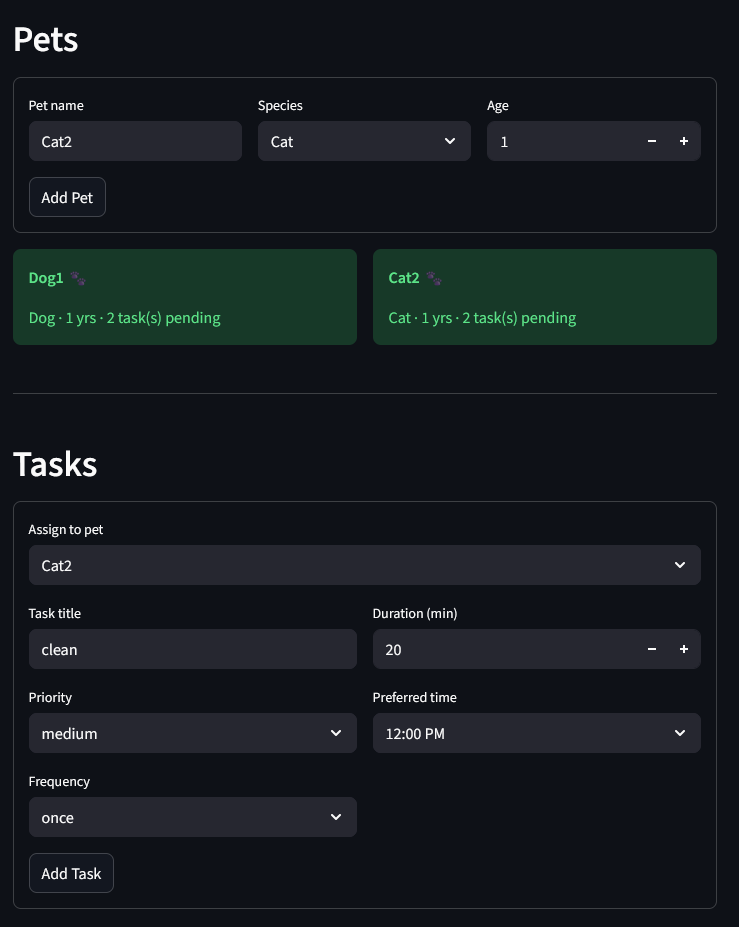
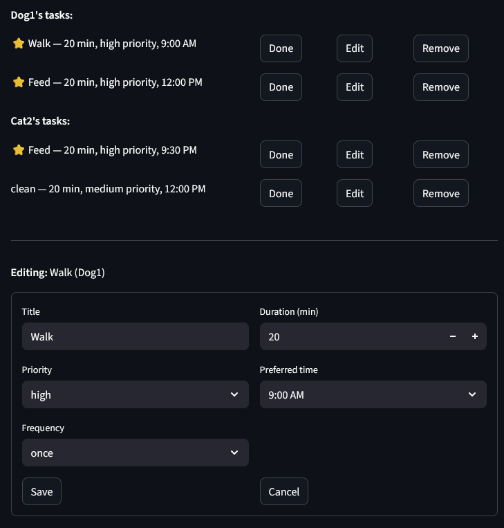
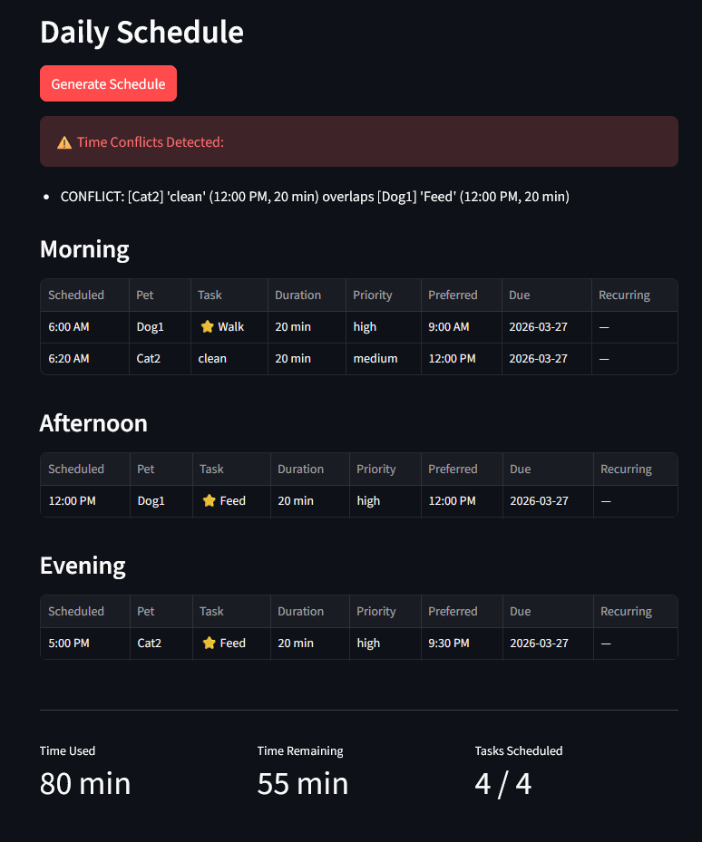

# PawPal+ (Module 2 Project)

You are building **PawPal+**, a Streamlit app that helps a pet owner plan care tasks for their pet.

## Scenario

A busy pet owner needs help staying consistent with pet care. They want an assistant that can:

- Track pet care tasks (walks, feeding, meds, enrichment, grooming, etc.)
- Consider constraints (time available, priority, owner preferences)
- Produce a daily plan and explain why it chose that plan

Your job is to design the system first (UML), then implement the logic in Python, then connect it to the Streamlit UI.

## What you will build

Your final app should:

- Let a user enter basic owner + pet info
- Let a user add/edit tasks (duration + priority at minimum)
- Generate a daily schedule/plan based on constraints and priorities
- Display the plan clearly (and ideally explain the reasoning)
- Include tests for the most important scheduling behaviors

## Getting started

### Setup

```bash
python -m venv .venv
source .venv/bin/activate  # Windows: .venv\Scripts\activate
pip install -r requirements.txt
```

### Smarter Scheduling
- Conflict detection — warns when two tasks have overlapping preferred times
- Scheduled vs preferred time — scheduler assigns a real clock time separate from what the user set
- Smart scheduling — high/medium tasks schedule near the pet's preferred time; low priority follows owner's slot preference
- Recurring tasks — daily/weekly tasks auto-create the next occurrence when marked done

### Testing PawPal+
```bash
py -m pytest tests\test_pawpal.py
```
Cheks if sort_by_time() correctly orders tasks based on preferred_time and still keeps both tasks when they have the same time. Verifies sort_tasks_by_priority() always places high-priority tasks before lower-priority ones, regardless of the order they were added. Conflict detection tests check that tasks with the same preferred time are flagged as conflicts after generate_plan().

Confidence Level: 5

## Features
- **Priority-based scheduling** - tasks are scheduled greedily from highest to lowest priority, with high and medium priority tasks placed at the pet's preferred time and low priority tasks placed in the owner's preferred time slot
- **Gap-finding placement** - when a preferred time is occupied, the scheduler finds the next available gap rather than discarding the task
- **Conflict detection** - identifies any two tasks whose preferred time windows overlap and surfaces a warning without crashing
- **Chronological display** - scheduled tasks are sorted by actual assigned clock time within each slot
- **Recurring tasks** - daily and weekly tasks automatically generate the next occurrence when marked complete
- **Filtering** - tasks can be filtered by pet, completion status, or both
- **Priority sorting** - tasks can be sorted from highest to lowest priority across all pets
- **Completion tracking** - tasks can be marked done or undone; completed tasks are excluded from scheduling
- **Deferred schedule updates** - the displayed schedule only updates when the user explicitly clicks Generate / Regenerate

## Demo





### Suggested workflow

1. Read the scenario carefully and identify requirements and edge cases.
2. Draft a UML diagram (classes, attributes, methods, relationships).
3. Convert UML into Python class stubs (no logic yet).
4. Implement scheduling logic in small increments.
5. Add tests to verify key behaviors.
6. Connect your logic to the Streamlit UI in `app.py`.
7. Refine UML so it matches what you actually built.
